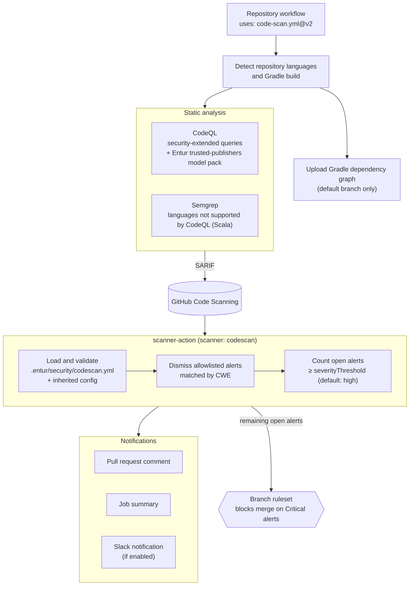
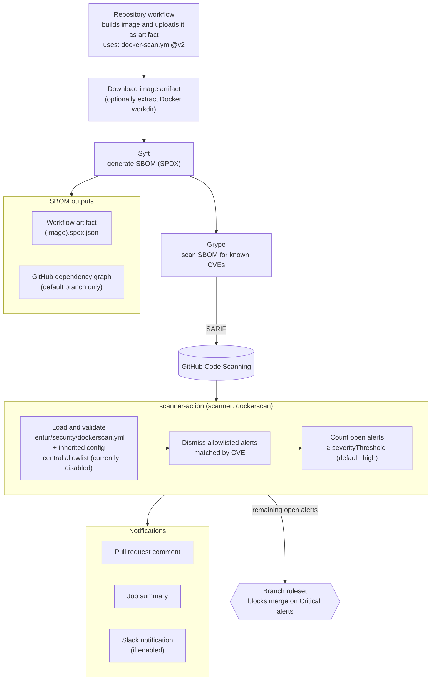

# Architecture

This document describes how the reusable workflows in `gha-security` fit together.
For a non-technical overview, see the [README](README.md). For usage and inputs, see
[Code scan](README-code-scan.md) and [Docker scan](README-docker-scan.md).

## Overview

Both workflows upload their findings as SARIF to GitHub Code Scanning, then run the
[scanner-action](scanner-action/README.md), which dismisses allowlisted alerts from
`.entur/security/*.yml` and notifies about remaining alerts at or above the severity threshold.

## Code scan

Build secrets passed through `additional_build_secrets` are only exported while CodeQL autobuild
and the Gradle dependency graph run, and are cleared afterwards.

## Docker scan

