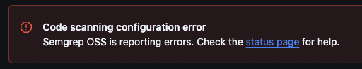
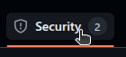
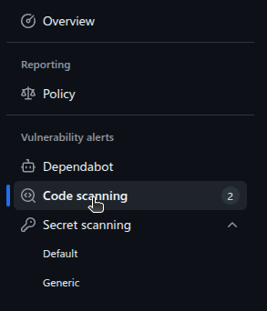
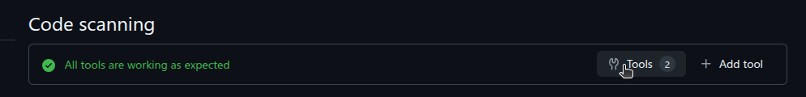
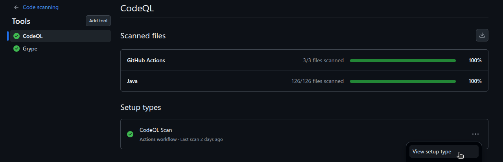
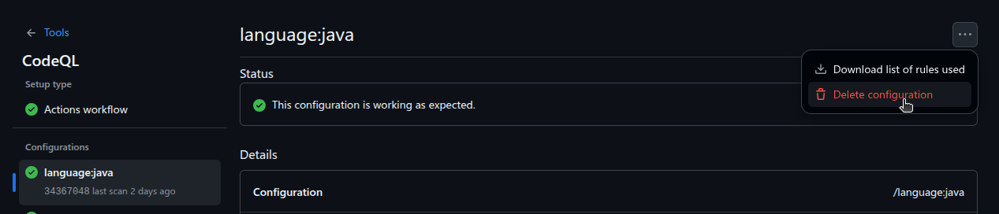

# `gha-security/code-scan`

## Usage

Add the following step to your workflow configuration:

```yml
jobs:
  code-scan:
    name: Code Scan
    uses: entur/gha-security/.github/workflows/code-scan.yml@v2
    secrets: inherit
```
or add the Entur Shared Workflow _CodeQL Scan_. Go to the _Actions_ tab in your repository, click on _New workflow_ and select the button _Configure_ on the _CodeQL Scan_ workflow.


## Inputs

<!-- AUTO-DOC-INPUT:START - Do not remove or modify this section -->

|                                                     INPUT                                                      |  TYPE   | REQUIRED |             DEFAULT             |                                                                                                                             DESCRIPTION                                                                                                                              |
|----------------------------------------------------------------------------------------------------------------|---------|----------|---------------------------------|----------------------------------------------------------------------------------------------------------------------------------------------------------------------------------------------------------------------------------------------------------------------|
|                   <a name="input_codeql_queries"></a>[codeql_queries](#input_codeql_queries)                   | string  |  false   |      `"security-extended"`      |                                                                                 Comma-separated list of queries for <br>CodeQL to run. By default <br>is set to security-extended.                                                                                   |
|                       <a name="input_gradle_opts"></a>[gradle_opts](#input_gradle_opts)                        | string  |  false   | `"-Dorg.gradle.jvmargs=-Xmx4g"` |                                                    [Gradle build options](https://docs.gradle.org/current/userguide/build_environment.html#environment_variables_reference) to pass on to <br>the CodeQL scanner                                                     |
|                 <a name="input_ignore_language"></a>[ignore_language](#input_ignore_language)                  | string  |  false   |                                 |                                  Comma-separated list of languages for <br>CodeQL or Semgrep to ignore. <br>See [CodeQL Languages](https://github.com/github/codeql-action/blob/main/src/languages.ts) or "scala" for <br>Semgrep                                    |
|              <a name="input_java_distribution"></a>[java_distribution](#input_java_distribution)               | string  |  false   |           `"temurin"`           |                                                                                                        Java distribution for "actions/setup-java" to <br>use                                                                                                         |
| <a name="input_java_server_id_artifactory"></a>[java_server_id_artifactory](#input_java_server_id_artifactory) | string  |  false   |                                 |                                                         Java server id for "actions/setup-java" <br>to use. This will setup <br>maven server with artifactory credentials <br>for CodeQL autobuild to use.                                                           |
|                      <a name="input_java_version"></a>[java_version](#input_java_version)                      | string  |  false   |             `"21"`              |                                                                                                          Java version for "actions/setup-java" to <br>use                                                                                                            |
|                         <a name="input_job_runner"></a>[job_runner](#input_job_runner)                         | string  |  false   |        `"ubuntu-24.04"`         |       Customizable job runner for CodeQL <br>or Semgrep jobs that require <br>a little extra performance/memory. List <br>of runners is available in <br>[Confluence](https://enturas.atlassian.net/wiki/spaces/ESP/pages/4989059095/GitHub+Actions+Runners).        |
|                 <a name="input_use_maven_cache"></a>[use_maven_cache](#input_use_maven_cache)                  | boolean |  false   |             `false`             |                                                                              Uses "actions/cache" to cache local <br>maven repository, and can speed <br>up autobuild times for CodeQL                                                                               |
|                <a name="input_use_setup_gradle"></a>[use_setup_gradle](#input_use_setup_gradle)                | boolean |  false   |             `false`             | OBSOLETE. This is now autodetected <br>and enabled if `build.gradle(.kt(s))` is <br>found. Uses "gradle/action/setup-gradle" before running <br>autobuild (Java/Kotlin/Scala only). Potentially speeds up <br>build times if cache from <br>main branch is utilized  |
|                   <a name="input_use_setup_java"></a>[use_setup_java](#input_use_setup_java)                   | boolean |  false   |             `false`             |                        Uses "actions/setup-java" before running CodeQL <br>or Gradle Dependency Graph (Java/Kotlin/Scala only). <br>CodeQL autobuild / Gradle Dependency <br>Graph will use the Java <br>version from "actions/setup-java".                          |

<!-- AUTO-DOC-INPUT:END -->

## Secrets

<!-- AUTO-DOC-SECRETS:START - Do not remove or modify this section -->

|                                                    SECRET                                                     | REQUIRED |                                                             DESCRIPTION                                                              |
|---------------------------------------------------------------------------------------------------------------|----------|--------------------------------------------------------------------------------------------------------------------------------------|
|           <a name="secret_ARTIFACTORY_APIKEY"></a>[ARTIFACTORY_APIKEY](#secret_ARTIFACTORY_APIKEY)            |  false   |                                           The API key for the <br>Artifactory repository.                                            |
|     <a name="secret_ARTIFACTORY_AUTH_TOKEN"></a>[ARTIFACTORY_AUTH_TOKEN](#secret_ARTIFACTORY_AUTH_TOKEN)      |  false   |    Token for the Artifactory repository. <br>Secret is fetched from Entur <br>GitHub organization if secrets are <br>inherited.      |
|       <a name="secret_ARTIFACTORY_AUTH_USER"></a>[ARTIFACTORY_AUTH_USER](#secret_ARTIFACTORY_AUTH_USER)       |  false   | The username for the Artifactory <br>repository. Secret is fetched from <br>Entur GitHub organization if secrets <br>are inherited.  |
|                <a name="secret_SLACK_BOT_TOKEN"></a>[SLACK_BOT_TOKEN](#secret_SLACK_BOT_TOKEN)                |  false   |  Slack bot token is used <br>for notifications. Secret is fetched <br>from Entur GitHub organization if <br>secrets are inherited.   |
| <a name="secret_external_repository_token"></a>[external_repository_token](#secret_external_repository_token) |  false   |  Token to access the external <br>repository mentioned in the codescan.yml <br>file. Must have read access <br>to the repository.    |

<!-- AUTO-DOC-SECRETS:END -->

## Golden Path

- Workflow must be named `codeql.yml`.

### Example

```yaml
# codeql.yml
name: "CodeQL"

on:
    pull_request:
        branches:
            - main
    push:
        branches:
            - main
        paths-ignore:
            - '**/README.md'
    schedule:
        - cron: "0 3 * * MON"
  
jobs:
    code-scan:
        name: Code Scan
        uses: entur/gha-security/.github/workflows/code-scan.yml@v2
        secrets: inherit
```


## Maven

Code Scan have been developed with Gradle in mind, so we can't guarantee every Maven project to work with default setup.

### Setup Artifactory

Maven uses `.m2/settings.xml` to setup server credentials for repository artifactory. 

Use setup below and replace `server_id_here` with the server id for repository artifactory.

```yaml
jobs:
  code-scan:
    name: Code Scan
    uses: entur/gha-security/.github/workflows/code-scan.yml@v2
    secrets: inherit
    with:
      use_setup_java: true
      java_version: "21"
      java_distribution: "temurin"
      java_server_id_artifactory: "server_id_here"
```

### Setup Maven Cache

To cache maven dependencies use the setup below.

```yaml
jobs:
  code-scan:
    name: Code Scan
    uses: entur/gha-security/.github/workflows/code-scan.yml@v2
    secrets: inherit
    with:
      use_maven_cache: true
```

**note: workflow input `use_maven_cache` is required for workflow to cache Maven dependencies.**


## Optional Dependency caching for Java/Kotlin (Gradle)

Code vulnerability scans of Java and Kotlin are done by running autobuild, which runs any identified build systems, like Gradle.

If the project uses the [gradle/actions/setup-gradle](https://github.com/gradle/actions/?tab=readme-ov-file#the-setup-gradle-action) action, you can set code scanning to utilize any available cache from the 'main' branch. This potentially speeds up code analysis jobs.


**Gradle Caching is detected by default.**

## Allowlists
The reusable workflow uses [CodeQL](https://codeql.github.com/) to scan the codebase for vulnerabilities. Any discovered vulnerabilities will be published in the _Security_ tab for the repository, under the _Code Scanning_ section. If you believe a finding is a false positive or otherwise not relevant, you can either manually dimiss the alert, or create a scanner config file (YAML-file) with allowlist spec that dismisses all alerts that matches a vulnerability ID. This list is then used in the current repo, but can also be shared and used with other repos.

*Note*: If the scan is performed on a pull request, remember to filter the Code Scanning results by pull request number and not the branch name.

See [Code Scan config](#code-scan-config) for how to setup allowlist in config.

## Notifications

Notifications will be sent out when there are alerts with severity equal or higher than threshold set. By default, high alerts will be notified under pull requests.

Notifications for Code Scan supports alerts from tool(s):
- CodeQL

Support for alerts from semgrep will be added soon.


**Severity threshold:**

Severity threshold is by default set to high, all alert with severity that equals the threshold or higher will trigger notifications.
The threshold can be set to one of the following values:
- low
- medium
- high
- critical

### Outputs

**Slack:**

Slack notifications are by default disabled, but can be enabled by creating a scanner config in repository or inheriting a shared config.

**Note:** The slack channel used for notifications needs to have `Github Actions bot` in the channel, see [gha-slack prereqs](https://github.com/entur/gha-slack/blob/main/.github/README.md#prereqs) on how to invite the bot. Additionally, you MUST specify `secrets: inherit` when calling the code-scan reusable-workflow.

The format and location of the config can be found [in the section below](#code-scan-config).

**Pull Request:**

Pull request notifications (comments) are enabled by default, but can be disabled by creating a scanner config in repository or inheriting a shared config.

The format and location of the config can be found [in the section below](#code-scan-config).

## Code Scan config

Requirements for Code Scan config:
- The config file MUST adhere to the [format specified later in this document](#schema).
- The config file MUST be named either `codescan.yml` or `codescan.yaml`.
- The file MUST be placed in `.entur/security`, relative to the root of the repository.

Shared config works by referencing it in when you define a spec for your project. The contents of the spec in config is then combined with the one in your repo. The contents of the "local" config takes presedence of the "external" config.

To use an external config create a YAML file in a different repository, reference the *name* of the repository in the `.spec.inherit` field of your config file.

Read Permissions of the repo containing any external allowslists are REQUIRED. It is important to note that a fine-grained access token must be created, with READ CONTENT permissions to the repository. The token then MUST be added as a secret to the repository where the workflow is executed, and MUST be named `EXTERNAL_REPOSITORY_TOKEN`.

You can find documentation on how to create a fine-grained access token [here](https://docs.github.com/en/enterprise-cloud@latest/authentication/keeping-your-account-and-data-secure/managing-your-personal-access-tokens#creating-a-fine-grained-personal-access-token), and how to add it as a secret to your repository [here](https://docs.github.com/en/actions/security-guides/using-secrets-in-github-actions#creating-secrets-for-a-repository).

Requirements for referencing an **external** config
- A fine-grained access token must be created to access the external Code Scan config file, with READ CONTENT permissions to the external repository.
- The token must be added as a secret to the repository where the workflow is run, and be named `EXTERNAL_REPOSITORY_TOKEN`.
- Any repository using an external Code Scan config file for inheritance, must still define `inherit` under spec referencing the name of the repo containing the external config file. See [schema](#schema) for more info.


### Schema

```yaml
apiVersion: entur.io/securitytools/v1
kind: CodeScanConfig
metadata:
  id: {unique identifier}
spec:
  inherit: {repository where the external allowlist file is placed}
  allowlist:
  - cwe: {cwe-id}
    comment: {comment explaining why the vulnerability is dismissed}
    reason: {reason for dismissing the vulnerability}
  notifications:
     severityThreshold: {threshold for notifications}
     outputs:
        slack:
           enabled: {boolean for enabling slack notifications}
           channelId: {slack channel with github actions bot}
        pullRequest:
           enabled: {boolean for enabling pull request notifications}
```

**Metadata:**

The `id` field MUST be a unique alphanumeric (no special characters) string identifing the allowlist. This can be anything, but when in doubt use your app ID.

**Spec:**

The OPTIONAL `inherit` field MUST be the name of containing repository where containing a valid `spec` you wish to inherit from.

The OPTIONAL `allowlist` field MUST be a list of vulnerabilities that you want to dismiss/allow. For each vulnerability you want to dismiss, you MUST add a new item to the list. Each item is an object and MUST contain the following fields: `cwe`, `comment`, and `reason`.
- The `cwe` field corresponds to the CWE-ID of the vulnerability you want to dismiss,
- The `comment` field is a comment explaining why the vulnerability is dismissed.
- The `reason` field MUST be one of the following types:
   - `false_positive` This alert is not valid
   - `wont_fix` This alert is not relevant
   - `test` This alert is not in production code

*Note:* `inherit` and items under `spec` are NOT mutually exclusive. Any items under `allowlist` and `notifications` takes precedence over an inherited spec.

The OPTIONAL `notifications` field
- The `severityThreshold` defines the threshold for when notifications are sent out.  
  The field MUST be one of the following types
   - `low`
   - `medium`
   - `high`
   - `critical`
- The `outputs` field corresponds to notification outputs.
   - The `slack` field SHOULD include:
      - `enabled` boolean for enabling slack notifications
      - `channelId` channelId for slack channel with github actions bot
   - The `pullRequest` field SHOULD include:
      - `enabled` boolean for enabling pull request notifications

### Example

```yaml
apiVersion: entur.io/securitytools/v1
kind: CodeScanConfig
metadata:
   id: myprojectconfig
spec:
  inherit: other-repo-name
  notifications:
     severityThreshold: "high"
     outputs:
        slack:
           enabled: true
           channelId: "SLACK_CHANNEL_ID"
        pullRequest:
           enabled: false
  allowlist:
  - cwe: "cwe-080"
    comment: "This alert is a false positive"
    reason: "false_positive"
  - cwe: "cwe-916"
    comment: "Wont be able to fix this in the near future"
    reason: "wont_fix"
  - cwe: "cwe-400"
    comment: "Used for testing purposes"
    reason: "test"  
```

## Github Rulesets

See [Security rulesets](README-security-rulesets.md) for how to setup code scanning merge protection ruleset.

## Troubleshooting

Some potential pitfalls and solutions with CodeQL

### Code scanning configuration error



Configuration errors such as the one above, can occasionally pop-up if no new analyses have been submitted for a long time. To fix the error, either trigger a new codescan, or [delete the old configuration](#ui-deletion).

### Code scanning results: Configuration(s) not found
This can happen if you have a previous analysis referencing earlier commits on the main branch for a configuration which is no longer valid. Typically this occurs to due a major change in the programming languages used in the codebase.

To fix this error it requires deleting all previous analysis for the invalid configuration. Example of such an analysis with a kotlin configuration:

```json
{
    "ref": "refs/heads/main",
    "commit_sha": "...",
    "analysis_key": ".github/workflows/codeql.yml:codeql-analysis",
    "environment": "{\"language\":\"kotlin\"}",
    "category": "/language:kotlin",
    "error": "",
    "created_at": "2025-01-03T12:42:17Z",
    "results_count": 0,
    "rules_count": 74,
    "id": 0,
    "url": "https://api.github.com/repos/entur/repository_name/code-scanning/analyses/....",
    "sarif_id": "...",
    "tool": {
      "name": "CodeQL",
      "guid": null,
      "version": "2.20.0"
    },
    "deletable": true,
    "warning": ""
  }
```

Invalid configurations can either be deleted through the API, or the UI.

#### API Deletion
See [Github documentation](https://docs.github.com/en/rest/code-scanning/code-scanning?apiVersion=2022-11-28#delete-a-code-scanning-analysis-from-a-repository

### UI Deletion
#### 1. Open the Security tab in your repository



#### 2. Open the Code scanning tab in the vulnerability alerts section



#### 3. Open the Code scanning tools tab



#### 4. Select the tool related to your configuration and click "View setup type" in the ellipsis list




#### 5. Select the failing configuration and click the "Delete configuration" button in the ellipsis list



### Autobuild fails for Gradle projects because of JVM version mismatch

This can happen if Autobuild detects the wrong version of the JVM to run Gradle with. This can be solved by 
updating workflow configuration to use `use_setup_java`

```yaml
jobs:
    code-scan:
        name: Code Scan
        uses: entur/gha-security/.github/workflows/code-scan.yml@v2
        secrets: inherit
        with:
          use_setup_java: true
          java_version: "21"
          java_distribution: "temurin"
```


### Autobuild fails for Gradle projects with multiple gradle project files.

Autobuild checks the root project file for which JVM version to set based on the version set on the JVM toolchain.
Github also has a page that explains it in more detail: [Autodetection for java](https://docs.github.com/en/code-security/code-scanning/creating-an-advanced-setup-for-code-scanning/codeql-code-scanning-for-compiled-languages#autodetection-for-java)

Autodetect will not find the correct version from child project files, if you have a root project file that does not compile JVM code. To fix this, you can trick autobuild with a comment.

The comment needs to be set on first line of the root project file (build.gradle)
```
// Hint for the CodeQL autobuilder: sourceCompatibility = <JVM_VERSION>
...
```

More detail about this fix in the [Github Issues thread](https://github.com/github/codeql-action/issues/1855#issuecomment-2161052577)

### Code scanning is very slow or fails after a long timeout.

It is now possible to override the runner used by GitHub to one with more cpu/ram. Input `JOB_RUNNER`.

The list of options is available in [Confluence](https://enturas.atlassian.net/wiki/spaces/ESP/pages/4989059095/GitHub+Actions+Runners)

Gradle build options can also be overridden to increase jvm memory. Input `GRADLE_OPTS`.

When CodeQL is triggered, the environment variable `IS_CODEQL_SCAN` is set to `true` which could be used to skip certain tests during build.

### Code scanning is failing on extracting javascript from project.
Recent changes to CodeQL will make analysis fail if a project has HTML file(s) without javascript/typescript, and no additional javascript/typescript files is found.

To fix this you can add dummy javascript to a HTML file, or add `html` to workflow input `ignore_language`.
```yaml
jobs:
    code-scan:
        name: Code Scan
        uses: entur/gha-security/.github/workflows/code-scan.yml@v2
        secrets: inherit
        with:
          ignore_language: "html"
```

**Note**
Following extensions is part of our HTML file extension detection
* .vue
* .ejs
* .htm
* .html
* .xhtm
* .xhtml