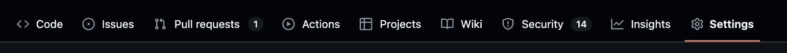
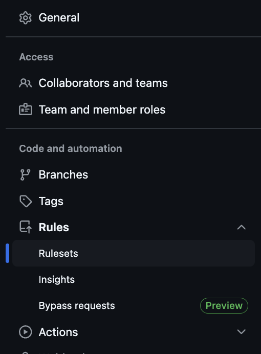
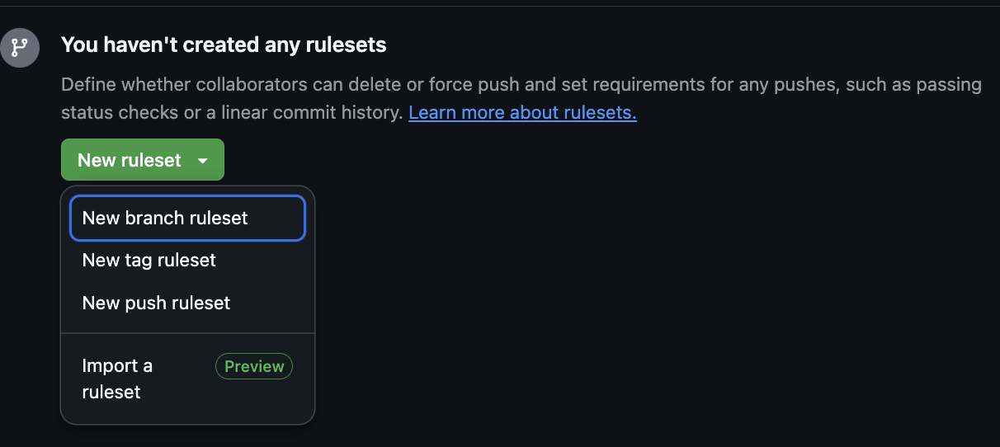
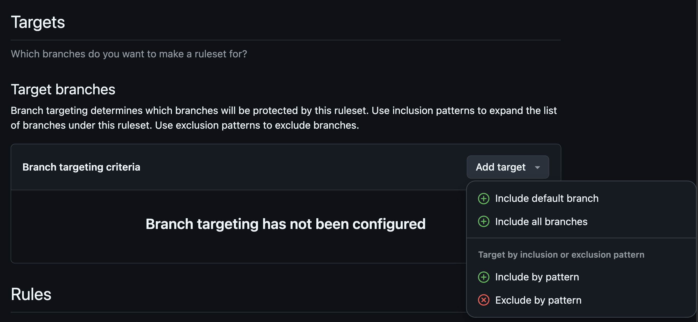
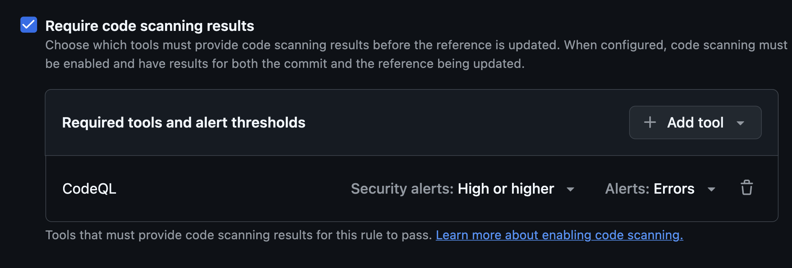
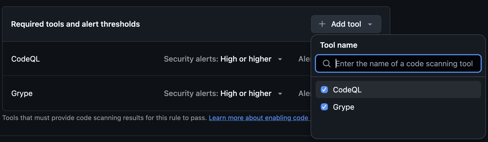
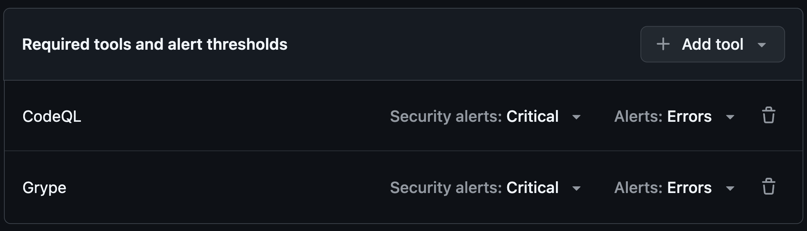
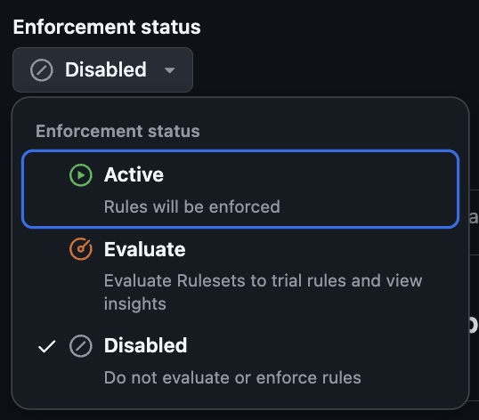

# `gha-security/security-ruleset`

## Code scanning merge protection

With Github ruleset, it's possible to make sure code scanning is required, and that critical vulnerabilities gets fixed before merging a new branch into main.

### Setting up ruleset

#### 1. Repository settings

Go to the repository settings.

#### 2. Select Rulesets under Rules dropdown

On the right vertical menu, click on rulesets that is under Rules section.

#### 3. Create new branch ruleset

Under new ruleset dropdown, select "New branch ruleset"  

Before continuing, give ruleset a name.  
example: "code-scanning-ruleset"

#### 4. Setup branch targets

Scroll down to Targets section and add new target branch.  
Select "Include default branch" inside "Add target" dropdown

#### 5. Enable code scanning results

Scroll down to "Require code scanning results" and enable it.

Add these tools to required tools if visible:
* Codeql
* Grype
* Semgrep.

Set "Security alerts" to Critical and Alerts to "Errors"

#### 6. Test out rulesets with Enforcement status.

Scroll back to top and test out the ruleset with Evaluate to see how it works.

