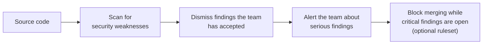
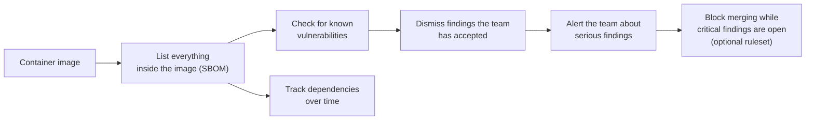

<h1 align="center">
      
       entur/gha-security 
</h1>

GitHub Actions for working with security tools.

- [Code scan](README-code-scan.md)
- [Docker scan](README-docker-scan.md)

Github rulesets
- [Security rulesets](README-security-rulesets.md)

For maintainers/contributors
- [Architecture](ARCHITECTURE.md)
- [Contributing](CONTRIBUTING.md)

## What it does

`gha-security` lets any Entur repository add security scanning with a single workflow step.
It scans the code and container images, lets teams mark accepted findings in their own
repository, and alerts the team about anything serious that remains.

### Code scan

### Docker scan

For how this is built, see [Architecture](ARCHITECTURE.md).
